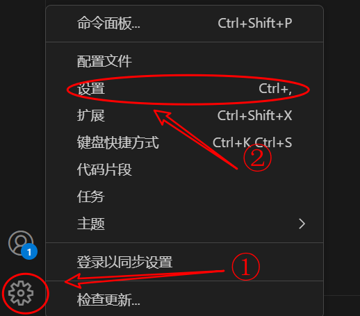

## 如何开始


0. 本项目基于`CMake`+`gcc`工具, 确保`CMake-Version >= 3.20`, 使用`cmake --version`查看
1. 打开Linux环境, 将该项目clone到工作目录下
2. 使用chmod命令为脚本添加执行权限
   - `chmod +x ./script/build.sh`
   - `chmod +x ./script/run.sh`

若要调试该项目, 建议使用`vscode`打开

1. 在`vscode`中下载`CMake`插件

2. 按如图步骤执行
    
    
    

3. 成功后, 会在底部显示如下配置框

    

4. 如图, 选择工具链, 然后点击生成按钮

    

5. 之后直接按`F5`即可开始调试

## 目录结构

```
|--.vscode/
|  |--launch.json   # gdb调试相关配置
|  |--tasks.json    # 项目生产相关配置
|
|--img/             # 自述文件使用的图片
|
|--include/
|  |--common/       # 通用
|  |--tools/        # 链表与红黑树
|  |--cfs_t.h
|  |--cfs.h
|  |--task_t.h
|  |--task.h
|
|--script/
|  |--build.sh      # 构建并生成项目
|  |--run.sh        # 运行测试文件
|
|--source/
|  |--tools/
|  |--cfs.c
|  |--task.c
|  |--CMakeLists.txt
|
|--tests/
|  |--CMakeLists.txt
|  |--test.c
|
|--.gitignore
|
|--CMakeLists.txt
|
|--README.md
```